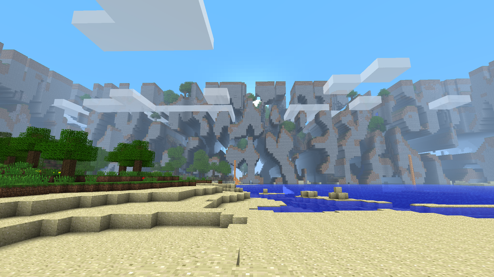

<table align="center">
	<tbody>
		<tr>
			<td width="280px" style="text-align: center;"></td>		
			<td>
				<h2 align="left">Not So Far Lands</h2>
				
				

					Mod that allows Farlands to generate much closer with configuration for the Overworld and the Nether.
				

				

					For Minecraft b1.7.3 and Fabric.
				

			</td>		
		</tr>
	</tbody>
</table>
